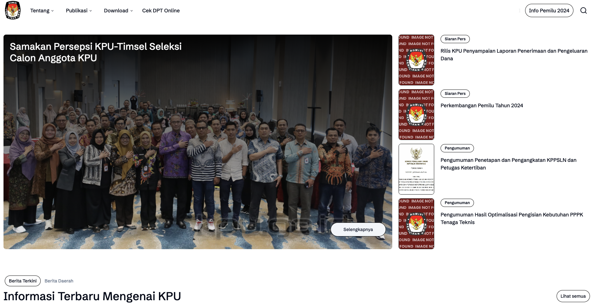

# KPU Website: Simplifying the Electoral Process

## Introduction
This repository houses the source code for a revamped KPU website, designed to enhance user accessibility and streamline the electoral process for Indonesian citizens. The website prioritizes a clean, responsive design, ensuring seamless navigation and a user-friendly experience across various devices.

## Key Features
- **Simplified Interface:** The website boasts a clear and intuitive layout, making it easy for users to find the information they need without getting overwhelmed.
- **Responsive Design:** The website adapts seamlessly to different screen sizes, ensuring optimal usability on desktops, tablets, and smartphones.
- **Comprehensive Information Hub:** Users have access to a wealth of election-related information, including election schedules, candidate profiles, and voting guidelines.
- **Interactive Voter Registration:** The website facilitates online voter registration, streamlining the process for eligible citizens.
- **Real-time Election Results:** Users can stay informed about election results as they unfold, ensuring transparency and credibility in the electoral process.

Check the new KPU Web [here](https://kpu.pages.dev/)